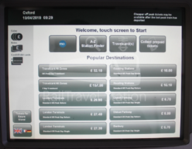

# [Barriers]

I want to create a database of every single train ticket I have bought.

# Theme  

On the surface, the project will appear as a simple database of my train journeys to uni, mostly numerical. However, upon closer inspection, the hidden messages weaved in-between the data will criticise the public transport system.

# Mechanics  

The users will be free to explore the site on their own and piece together the narrative I create.

# Aims  

I want to tackle the problems with the TFL system, particularly with the cost-of-living crisis and the strikes that have been happening over the past year.

# Aesthetics

The homepage will be a recreation of the train station ticket machine interface - copying its aesthetics and style.

# Technology 

I will create an HTML webpage.

